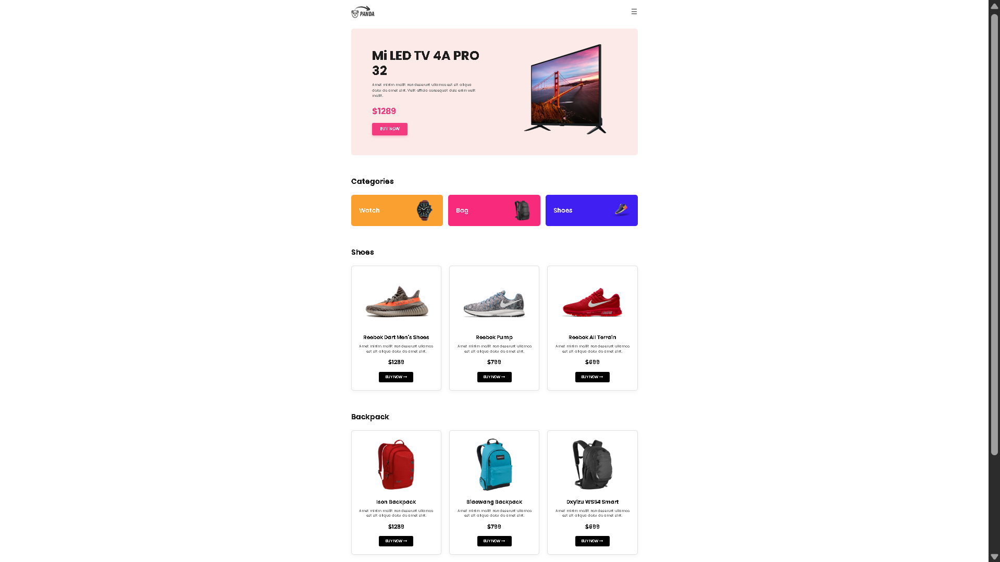

# Goods Panda - E-commerce Landing Page 🐼

## 📖 Overview
A fully responsive and modern e-commerce landing page built using raw HTML5 and CSS3. This project was carefully designed to be responsive across all devices (Mobile, Tablet, and Desktop) without using any external CSS frameworks. 

This project was completed as an assignment for the **Web Development Kickstart** course.

## 🚀 Live Demo
[Click here to view the live project](https://atul-dev-ai.github.io/panda-assignment/) 

## ✨ Features
- **Responsive Design:** Fluid layout adapting perfectly from 320px mobile screens up to 1200px+ large displays.
- **Product Sections:** Beautifully structured categories, shoes, and backpack sections.
- **Flexbox Layout:** Advanced use of CSS Flexbox for alignment and structure.
- **Interactive UI:** Smooth hover effects on buttons and product cards.
- **Newsletter Form:** Clean and centered subscription section.

## 🛠️ Technologies Used
- HTML5
- CSS3 (Vanilla)

## 🙌 Acknowledgements & Credits
- **Course:** Web Development Kickstart by [Programming Hero](https://web.programming-hero.com/)
- **Resources:** Special thanks to [ferdouszihad](https://github.com/atul-dev-ai/panda-assignment.git) for providing the image resources and design guidelines for this project.

## 👨‍💻 Author
**Atul Paul**
- GitHub: [atul-dev-ai](https://github.com/atul-dev-ai)
- LinkedIn: https://linkedin/in/paul-atul
